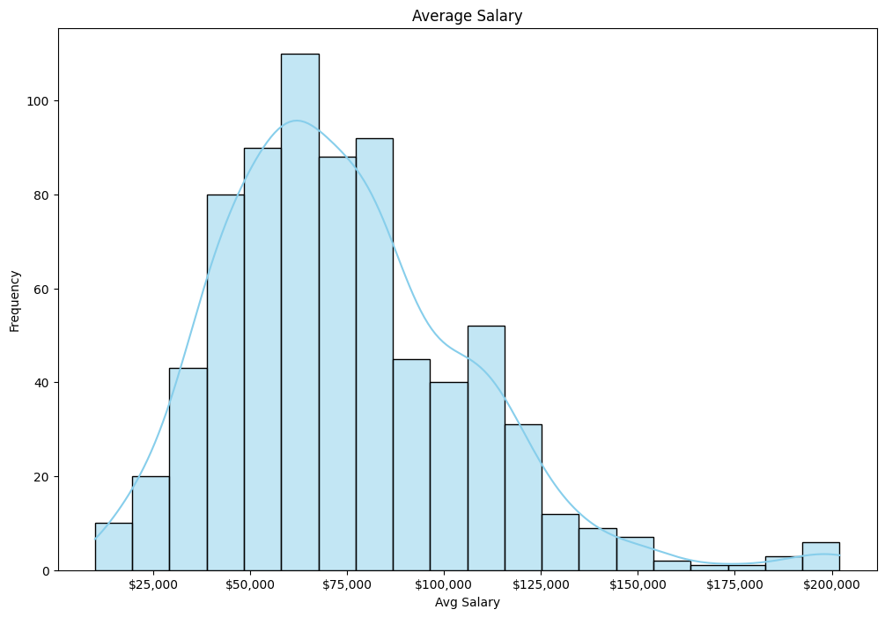
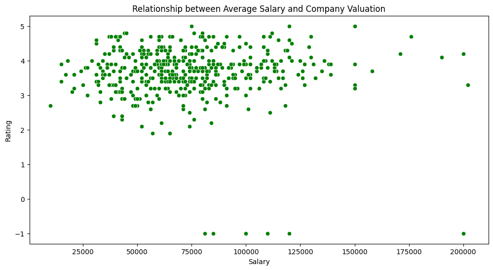

# Análise de Ofertas de Emprego na Área de Dados
### Descrição
##### Este projeto realiza uma análise exploratória de ofertas de emprego na área de dados, utilizando dados obtidos de: https://www.kaggle.com/datasets/hummaamqaasim/jobs-in-data.

Este projeto analisa ofertas de emprego na área de dados, visando insights sobre tendências salariais, habilidades mais demandadas, entre outros.

#### Dados Utilizados:
Os dados foram obtidos de https://www.kaggle.com/datasets/hummaamqaasim/jobs-in-data, estão disponíveis no formato CSV, e qualquer manipulação realizada está detalhada na análise.

#### Objetivos:
Identificar tendências salariais.
Explorar demanda por habilidades específicas.
#### Tecnologias Utilizadas:
Python, 
Pandas, 
Seaborn, 
Matplotlib

#### Resultados e Visualizações
Veja exemplos de visualizações geradas durante a análise no README, destacando insights importantes.

#### Conclusões
Conclusões principais destacam-se na análise, fornecendo insights valiosos sobre o mercado de trabalho na área de dados.
